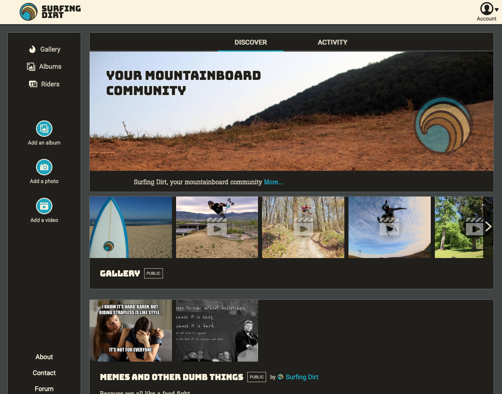
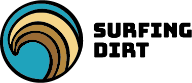
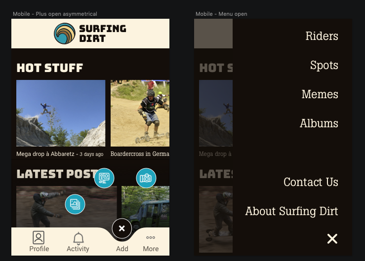
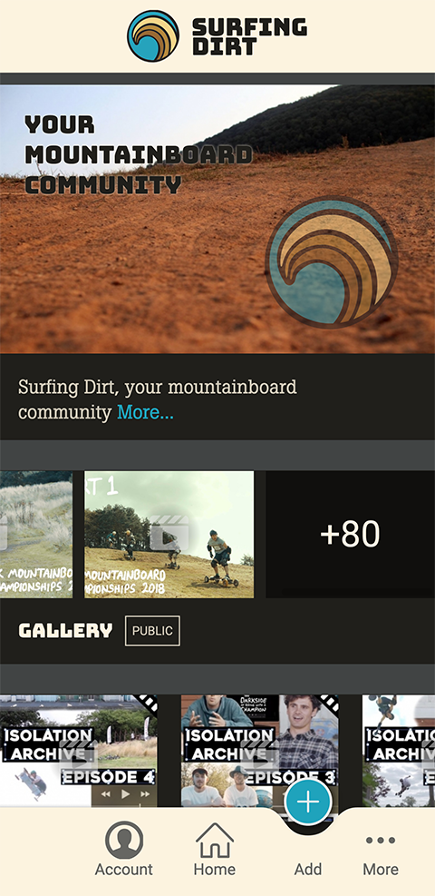
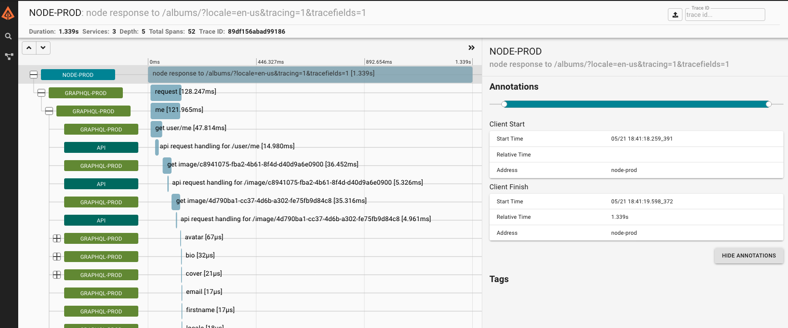

<figure class="content-image">
	
	<figcaption>Surfing Dirt's homepage</figcaption>
</figure>

After a year of hard work as a side-project, I was finally able to release the first version of Surfing Dirt, my new
(humble) social network for mountainboarders (this is mountainboarding).

[Check out the live version](https://www.surfingdirt.com/)

## Repos:
All of the code is hosted on GitHub:
- [The Rest API](https://github.com/surfingdirt/rest-api)
- [The GraphQL layer](https://github.com/surfingdirt/graphql)
- [The web client](https://github.com/surfingdirt/web)

## Overview

This is going to be a rather long post, so I added some navigation here:
1. [Some context](#context)
2. [The stack](#stack)
3. [Concerns and priorities](#concerns)
4. [The branding and UI design phase](#design)
5. [Application layers](#layers)
    * [The Rest API](#api)
    * [GraphQL](#graphql)
    * [The client](#client)
6. [Tracing](#tracing)
7. [Deployment](#deployment)
8. [Lessons learned](#lessons)

## 1. Some context 
Surfing Dirt is my attempt at building a social network, to revive a now-dead message board.

  

    History of the project
  

  

    Surfing Dirt started out as a message board, run by a mountainboarder based in Costa Rica. For a little while, it was
  the best place for people online to talk mountainboarding.
  

  

    I have a thing for message boards, and so it made me sad when attendance declined and fewer people started posting. On
  top of that, the person hosting it screwed up and the site just became unavailable for a long while. Sad
  mountainboarders.
  

  
  

    In 2016, I managed to get hold of the last backups, took the domain name over, ported the content from vBulletin to
  phpBB, and <a href="https://www.surfingdirt.com/forum">put it back online</a>. The damage was done though, and users did not
  return.
  

  
  
  
    I took that as an opportunity to build something else, something more modern, that would hopefully try and
    <a href="/The-death-of-the-message-board/">reclaim users from Facebook</a>.
  

## 2. The stack 
I started the project over the 2018 Winter holidays. My goal was to build something robust and clean, while at the same
time allowing to me learn new things like GraphQL and solidify was knowledge of React.

I set out for the now common Rest API/GraphQL middle layer/React client combo, to you know, see if it would work for me.
As we all know, there is so much hype in the Javascript world, it's hard to get a sense for what is good and sensible,
and what's overblown fad.

  
The REST API: Docker/Nginx/PHP/MySQL/Memcached

  

    I wasn't sure whether I wanted to reinvent the wheel or use off-the-shelf. Starting from scratch
    is dumb in a way, but it also forces you to sit down and really learn know every little bit of your stack. Using
    off-the-shelf components gets you started fast but it can also come to a stop when you hit a nasty bug or you discover 
    something is fundamentally incompatible with what you built.
  

  

    I tried to find an existing, open-source GraphQL CMS. <a href="https://strapi.io">Strapi</a> looked promising but it
    was not quite ready yet for what I wanted and after trying a couple more, I settled for repurposing
    <a href="https://github.com/mikaelgramont/World-Mountainboard-Day">a PHP project I started back in 2011</a>
    which was built on v1 of the Zend Framework.
  

  

    I'd already written lots of code for user management, forums, image uploads, events and all kinds of things. Back in
    2012 I even wrote a Node app for testing the API. All of this gave me a nice head start, I just needed to modernize
    it all a bit, and to trim down the list of supported features.
  

 

  
GraphQL: Express/Apollo Server

  

    Nothing crazy here, I went with a mix of <a href="https://expressjs.com/">Express</a> and 
    <a href="https://www.apollographql.com/docs/apollo-server">Apollo Server</a>, two well-known projects.
  

  
JS Client: Express/React/Webpack/Apollo client

  

    I reused the same combo we were using at <a href="https://www.onrewind.com/">work</a>: Express/React/Webpack because
    I figured I'd have someone to talk to if I got stuck with Webpack config, which is something I still hate to this
    day.
  

## 3. Concerns and priorities 
In no particular order, these are things that I wanted to nail:
- An attractive mobile-first design.
- Responsive design (one single codebase) and implementation. One of the aspects of webdev I enjoy the most.
- Progressive enhancement. So many sites and apps are JS-only performance monstrosities. I wanted to keep things under
control there by starting with a no-JS baseline. 
- A11y. This is a tough one because you can never get to 100%, but the least you can do is try.
- The ability to build the site into a PWA (not done at this point).

## 4. The branding and UI design phase 
This actually came after I built the REST API and GraphQL layers because I wanted to get those "less fun" things out of
the way first.
I reached out to my friend Margo at <a href="https://highmountaincreative.com/">High Mountain Creative</a> for a logo
because after 2 years thinking about it, I still wasn't comfortable creating my own. Margo delivered!

<figure class="content-image" style="background: #fff">
	
	<figcaption>I love this Surfing Dirt logo!</figcaption>
</figure>

Based on that, I set out to create a design that would work for mobile and modified it later to work on desktop.
I wanted the design to convey that as a social network,
[posting things was at the tips of your fingers](https://www.youtube.com/watch?v=kEgLZUOvLxc). 

<figure class="content-image">
	
	<figcaption>Early designs for the mobile version - <a href="../documents/www.surfingdirt.com.sketch">full Sketch file here</a></figcaption>
</figure>

I ended up staying pretty close to this design, but of course over the course of a year, it changed a bit:

<figure class="content-image">
	
	<figcaption>The design at launch time</figcaption>
</figure>

## 5. Application layers 
Since I don't have a plan here, I'll just throw random notes on noteworthy things in this section.

### The Rest API  
- [JSON Web Tokens (JWT)](https://jwt.io) are cool... but they do come with some problems, namely there's no elegant and
 simple way to manage revoking them (either you build a blacklist, or you change you signing key, which essentially logs
 everyone out)
- I put and retrieve objects from a cache through overloading of ZF's Active Record object methods, eg:
`$this->fetch()` will check the cache before talking to MySQL. All my business objects inherit from the same 
`CacheObject` class, and so they all get caching for (mostly) free.
- That pattern of all classes inheriting from the same object is not great for maintenance. Fortunately, PHP now has
traits so it would have been possible to avoid code duplication by doing composition instead of inheritance.
However I wrote this PHP layer more than 10 years ago, and I'd rather not mess with it, so it's ugly af... and will
remain so.
- The caching strategy is rather naive: if the first request doesn't find an entry in the cache, it will go to the
DB, and then populate the cache. Should the load go up a lot, we'd potentially bring the DB down before we're able
to populate the cache. It would be nice to implement some kind of cache warming strategy, or harder, do something
smarter.
- Much like I did back in 2012 with the original project, I wrote a set of automated API tests that run and call the API
a bunch of times to exercise all the resources, through all supported REST methods. These tests are the most valuable
asset in the codebase, I think. They document the API and they make sure it runs properly. Sadly I never integrated them
in a CI/CD system (definitely one of my weak points).  

### GraphQL 
This was surprisingly straightforward for the most part, if only a bit challenging in terms of organizing code.
- Using JWT for authentication was a breeze at this level, as it was just a matter of passing JWT headers through
- Same thing for the locale info with the HTTP 'Accept-Language' header.
- The only thing that required a bit of digging was file uploads. Being a noob when it comes to streams in Node, I did
not figure out a way to pipe the uploaded file stream through to the REST API directly. As a result, all file uploads
get written to disk, passed down, and then deleted. Not ideal as it slows down uploads (but probably not all that much).

### The client 
A lot of things to cover here!
- The project supports multiple locales, as well as RTL languages (thanks to a dedicated PostCSS plugin). Handling the
actual translation was both cool and annoying.
    - Cool because I got to play with DeepL's (paid but cheap) and Google's Translation APIs and I could attest that
    they worked rather well by checking the Spanish translations.
    - Annoying because I knew the translations weren't perfect and so releasing them as-is felt bad. I reached out to
    friends around the world to help me, but it's a thing you can't really ask about too many times. So updates that
    introduce new text will probably be released with auto-translation only, as I can't afford to pay pros to do them. 
- I initially set out to build the client as a no-js thing because I knew it would force me to ask the hard questions
early on: **what do form submissions do when JS is out?** Answer: they send data to the Express server which will handle
the request through a dedicated route.
Since I was going to use GraphQL on the client (through Apollo Client), I then needed to run GraphQL queries from
Express. I wrote my own little client, and it turns out that wasn't too hard! GraphQL is a really well designed project
and the HTTP layer is easy to understand. I did use [Postman](https://www.postman.com/) quite a bit to experiment
though, and that helped a lot.
- Again because of the No-JS thing, I tried to make sure none of the layout stuff relied on Javascript. It's all CSS.
Initially, I had the menus powered by JS, but now I've updated the project and navigation fully works with JS disabled!

## 6. Tracing 
Because I knew about [GraphQL's infamous N+1 problem](https://medium.com/slite/avoiding-n-1-requests-in-graphql-including-within-subscriptions-f9d7867a257d),
I was worried about the likely bad performance of the whole backend layer. Some of the GraphQL objects I handle in this
application are deeply nested, and it was very possible that the whole thing was horribly slow.
Take for example, the case of the [albums page](https://www.surfingdirt.com/albums): the objects represented here
consist in a list of album objects, each containing a list of media, each media belonging to one user and being linked
to a video or an image.

In order to have an idea of how the whole thing behaved, I needed some kind of profiling tool. In a microservice system
such as this one, that concept translates as "tracing", and this is where I discoved [OpenTracing](https://opentracing.io/).

By implementing OpenTracing in the REST API and the GraphQL layers, and sending data to a [Zipkin](https://zipkin.io/)
Docker instance I was able to trace all the HTTP requests made from the moment my Web client ran a GraphQL query or
mutation. Awesome! Adding some local MySQL log analysis and I now had a bunch of info to optimize things.

<figure class="content-image">
	
	<figcaption>Analyzing a trace via Zipkin's UI</figcaption>
</figure>

What I learned here:
- each request to the PHP layer caused a MySQL query to run because the PHP MySQL client always ran a `SET NAMES utf8'
regardless of whether it needed to talk to the database at all. Silly, but easily fixed.
- with a properly warm cache, only mutations (and authentications) required to talk to the database.
- since the PHP server and the GraphQL server are running off the same virtual server instance, HTTP requests between
them are pretty damn fast. Not instant by any means, but fast enough that the N+1 problem could wait. Woohoo!
- Tracing is hard! I got it to work but some of the concepts flew right over my head. 

## 7. Deployment 
My god, I'll never be a DevOps person. I am brought to the DevOps table kicking and screaming. I still learned some
basic Docker skills in order to do this though!
My setup:
- Server 1 runs Nginx as a reverse proxy, with Let's Encrypt running SSL stuff and sends requests to server 2
- Server 2 runs PHP, Memcached and Zipkin inside a Docker container. Next to that is my GraphQL Node server, and the
web site Node server (I also have everything duplicated in order to have a beta, aka staging environment).

## 8. Lessons learned 
Front-end lessons:
- Responsive images are hard! What I struggled the most with is that the establised way to inform responsive image sizes
is to refer to the size of the window. Until we have element queries, there are a whole class of use cases where you
won't be able to be exactly precise when specifying which image size should load. Ugh.
- It's 2020 and forcing element aspect ratios in CSS is still *really* hard!
- Grid is awesome.
- **Respecting progressive enhancement even with a modern framework can be done**. It's more work than people usually put in,
but if you have a lot of traffic, you've got to do it. I'll write more on this!

Backend lessons:
- You can write your own GraphQL client! Of course it will be more fragile than other established ones but if it doesn't
run in a browser, that means you really only need to worry about one environment and that can cut down risks.
- GraphQL is nice... but it's probably only worth it if you can dedicate a team to maintaining and optimizing it.
Quoting [Tom McWright's article "Second-guessing the modern web"](https://macwright.org/2020/05/10/spa-fatigue.html):
> [...] a generically-designed REST API that tries not to mix ‘concerns’ will produce a frontend application that has to
> make lots of requests to display a page. And then a new-age GraphQL application will suffer under the N+1 query
>problem at the database level until an optimization arrives. And a traditional “make a query and put it on a page”
>application will just, well, try to write some good queries.
>
> None of these solutions are silver bullets: I’ve worked with overly-strict REST APIs, optimization-hungry GraphQL
>APIs, and hand-crafted SQL APIs. But no option really lets a web app be careless about its data-fetching layer. Web
>applications can’t sit on top of independently-designed APIs: to have a chance at performance, the application and its
>datasource need to be designed as one.

I'd go further and say that ideally, your GraphQL server would talk directly to your database and cache instances. Just
throw REST out the window if you can. In this case I could, but will I? Maybe on the next project :)

- Building and deploying Docker images for Node projects is overkill outside of a CI process. A simple `git clone`
followed by an `npm install` can get you pretty far.

## 9. Conclusion
What a ride! Getting from first line to launch took me 15 months! I'm pretty happy with what I have at this point
because it works rather well, and gives me a good baseline to build additional features. I'll probably focus on some
community management for now, as I'm a little burned out on the project. 
