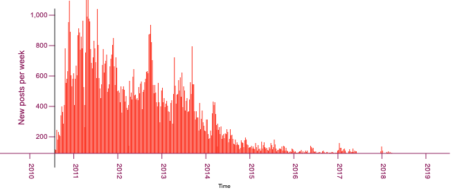

<figure class="content-image">
	
	<figcaption>Generating this chart was my first goal for learning D3</figcaption>
</figure>

I recently decided that I was finally going to try D3. I subscribed to [Front-End Masters](https://www.frontendmasters.com/) to try their D3 classes: [Introduction to Data Visualization with d3.js v4](https://frontendmasters.com/courses/d3-v4/) and [Data Visualization for React Developers](https://frontendmasters.com/courses/d3-js-react/).

Here are my notes, as a way to remember what I've learned better, and to document and share it.

Some the high-level notes:
- the process to get from data in a CSV to a nice graph is rather streamlined
- D3 handles DOM elements directly. It has an efficient (but confusing) API for handling transitions
- You can combine D3 and React directly without much interference... up to a certain point
- For things like axis and transitions, D3 needs direct access to DOM elements. If those DOM elements are rendered by React, things get harder
- SSR: D3 APIs that rely on DOM element references make it really hacky to do SSR 
- [VX](https://vx-demo.now.sh/) is a React equivalent to D3's APIs, plays nicer with SSR, the best of both worlds

## Key takeaways
Except for the complex rendering components, D3 is not rocket science from a user's perspective. Its value is mostly in providing a ton of methods to make graph generation straightforward. The rendering part is usually down to SVG which means:
- *knowing SVG well is important*
- *building your own rendering component is easy enough once D3's core concepts are understood*
- D3 makes it easy to pick and choose the parts you need, in order to keep bloat down

## Resources:
- [Official D3 site](https://d3js.org/)
- [FEM slides from intro to D3](https://slides.com/shirleywu/fm-d3intro)
- [Blockbuilder](https://blockbuilder.org), a mine of information
- [D3 tutorials](https://www.dashingd3js.com/table-of-contents)
- lots of [array manipulation methods in D3](https://github.com/d3/d3/blob/master/API.md)
- [Github repo for things I've written as I learned](https://github.com/mikaelgramont/react-d3)

## D3 notes
This section is based on [Introduction to Data Visualization with d3.js v4](https://frontendmasters.com/courses/d3-v4/)

### Data types
They can be:
- categorical (ex: genres)
- ordinal (ex: t-shirt sizes)
- quantitative (ex: temperatures)
- temporal (ex: dates)
- spatial (ex: cities)

### Basic charts
- bar chart: domain (input): categorical, range (output): quantitative. ex: nb of movies per genre
- histograms: domain: quantitative bins, range: frequency of quantitative bin
- scatterplot: 2 attributes and the relationship between their quantitative values
- line charts: domain: temporal, range: quantitative
- trees: one-directional hierarchy
- node-link: show relationships b/w entities (cyclical graphs)
- choropleth: domain: spatial regions, range: quantitative (look up datawrapper choropleth)


### Selections: the .selectAll().data().enter().append() pattern
It's worth reading [Mike Bostock's doc on joins](https://bost.ocks.org/mike/join/) to understand the API.
Also good, [another one on Observable](https://observablehq.com/@d3/learn-d3-joins?collection=@d3/learn-d3). Choice quote:

> D3 selections fill a particular niche: fast, incremental updates of dynamic graphics. If your focus is on static graphics, or graphics that can be redrawn from scratch each frame, you may prefer a different abstraction. On the other hand, if you want animated transitions or to squeeze the best performance out of modern browsers, selections are for you.

Some more notes:
- data():
    - binds data and returns the 'update' selection of items: those whose data has changed
	- takes a 2nd argument: the key function, returning a value similar to React's
- enter():
	- returns the 'enter' selection of items: those to be added (can be done via .append())
	- chain it with .attr() that don't depend on the data
- exit():
	- returns the 'exit' selection of items: those to be removed
	- chain it with .remove() to actually remove those items
- merge():
	- combines selections, in the end, bars is new + updated items:
		const select = svg.selectAll();
		const update = select.data();
		const enter = select.enter();
		const bars = enter.merge(update);
- join() takes 3 arguments: enter, update, and exit functions

### Scales
[Scales](https://github.com/d3/d3-scale) map input (domain) to output (range) and can be continuous, quantized, ordinal, or others.
```
const myScale = d3.scaleLinear()
    .domain([10, 130])
    .range([0, 960]);
const scaledOutput = myScale(50);
```	

### Axis
[d3.axis](https://github.com/d3/d3-axis) methods build axis and ticks out of DOM elements.

### Shapes
[d3.shapes](https://github.com/d3/d3-shapes):
- feed d3.line().x().y() into an svg path's d attribute
- d3.pie()(data) generates data points with startAngle and endAngle for use with methods on d3.arc()

### Transitions
```
d3.transition().duration(750)
```
- pass it .attr() that should be animated to => must match .attr() in enter() and data(), otherwise it animates from default (0, black, etc.)
- recreate the transition in every update callback otherwise, defaults back to 250ms

## D3 and React notes
These notes are from [Data Visualization for React Developers](https://frontendmasters.com/courses/d3-js-react/)

- Normally, D3 uses enter-update-exit to handle data updates and transitions. React can take that over with its reasonably efficient diffing (will have to see about transitions though).
- Recommendations: 
    - Use one component per chart. Its role is to translate data to screen space
    - Pass raw data in as a prop.
    - The component performs the rendering
    - It manages state for interactions that don't require redrawing of the whole chart: hover, click
    - Filtering/sorting data should be done in the parent
- DOM clashes:
    - **Axis, transitions, brush, zoom don't play well with React,** This is because they access the DOM directly which is what React wants to do naturally. Using refs can help... up to a certain point.
    - Generating an axis means you need an element as an anchor. This is painful with SSR, because d3 takes over the generation of the children of that axis, so we need to extract them and move them around. [This is one way to do it](https://medium.com/better-programming/react-and-d3-axis-e8952d8d31e6#b7c2), it's ugly af, but that is how it is.
- [Working example of axis](https://codesandbox.io/s/kop49w9r2v?module=/src/visualizations/Chart.js&file=/src/visualizations/Chart.js)
- Transitions are painful too!
	- [https://slides.com/shirleywu/deck-11#/51](https://slides.com/shirleywu/deck-11#/51)
	- either share responsibilities (rendering elements in react, transitioning in D3)
	- or do it all in D3 with enter/update/exit
- Brushes let a user perform a range selection inside a graph
- For legends: lookup d3-legend and react-annotation
- Canvas:
    - Appropriate rendering method for when there are many many data points (ie, 2000+ svg elements)
 	- D3 provides a bunch of methods to drive the canvas context by passing commands directly to it. Suprisingly easy

## VX
[AirBnB's VX](https://vx-demo.now.sh/) is essentially a reimplementation of D3 that plays well with React.
It solved the SSR issues above, and there is a 1-to-1 mapping of concepts and components with D3.
This is good way to go for React work.

## Conclusion
As evidenced by its popularity, D3's one nice library, with a ton of things to learn. Except for the initially weird data().exit().append() stuff, it's all very straightforward and the APIs just make sense, so the learning curves levels off pretty quickly (at least I think so at this point!).
Bringing React into the picture muddies the water a little bit, and forces you to really understand what's going on if you don't want all kinds of rendering and interaction bugs.
Finally, VX makes it easy to merge D3's and React's concepts and keep it all under control. For existing React project I'll probably use it, otherwise I'll try to go vanilla JS and use D3 directly. 